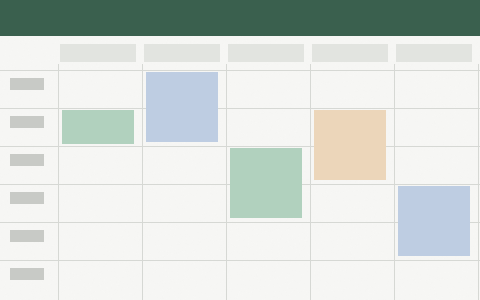

---
# MODÈLE À COPIER. Copiez ce fichier dans questions/, donnez-lui un nouveau nom, puis remplacez tout.
# Les lignes qui commencent par # sont des commentaires : le build les ignore.
#
# Le nom du fichier, sans .md, est l'identifiant de la question. Il sert d'ancre dans l'adresse
# /aide#nom-du-fichier, donc il ne change plus jamais après la publication. Écrivez-le en
# minuscules sans accent, avec des tirets : client-rendez-vous-introuvable.md
#
# question (obligatoire) : une seule phrase, 90 caractères au maximum, terminée par un point
# d'interrogation, écrite comme un réparateur la dirait. Pas de guillemets autour. Deux questions
# ne peuvent pas avoir exactement le même texte.
question: Comment faire cela dans l'application ?
# categorie (obligatoire) : un identifiant de categories.json, c'est-à-dire rendez-vous, demandes,
# clients, factures, reservation ou compte.
categorie: rendez-vous
# ordre (facultatif) : un nombre entier. Le plus petit passe en premier dans sa catégorie.
# Sans ordre, la question passe après les autres, par ordre alphabétique.
ordre: 1
# mots (facultatif) : ce qu'un réparateur pourrait taper dans la recherche, séparé par des virgules.
mots: agenda, introuvable, disparu
---
EXEMPLE, à ne pas publier. Remplacez tout ce texte par la vraie réponse.

Au-dessous de la ligne ---, la réponse tient en 5 phrases environ et 1 200 caractères au maximum, avec un seul geste à faire. Dites ce qu'il faut cliquer, dans l'ordre. Mettez en **gras** le nom d'un écran ou d'un bouton, par exemple **Agenda**, et en *italique* ce que vous voulez nuancer.

Pour une suite d'étapes, écrivez une liste numérotée :

1. Ouvrez **Agenda**.
2. Choisissez la date du rendez-vous.

Pour renvoyer vers une page de l'application, écrivez [Réglages](/reglages). Pour un site extérieur, [le lien](https://exemple.fr) commence par https://.

Pour une capture, déposez l'image dans le dossier images/ et écrivez une ligne comme celle-ci, avec un texte alternatif qui décrit ce que l'on voit :

